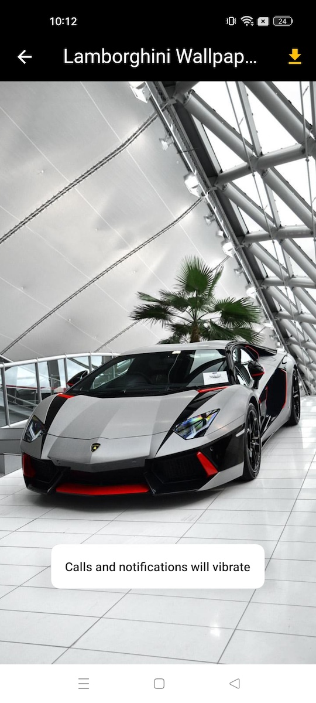

# Reddit Wallpapers App

iWallpaper is an open-source Flutter application that fetches the latest wallpapers from the popular subreddit `r/iWallpaper`. The app allows users to browse and download high-quality wallpapers directly to their devices.

### Features
- Browse Wallpapers: View the latest wallpapers from r/iWallpaper.
- Download Wallpapers: Save your favorite wallpapers to your device with a single tap.
- High-Quality Images: Enjoy wallpapers in high resolution.
- Easy to Use: Simple and intuitive user interface.

## Screenshots

